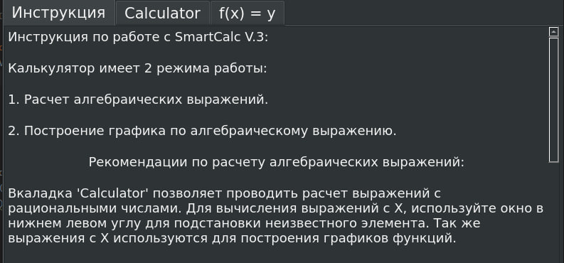
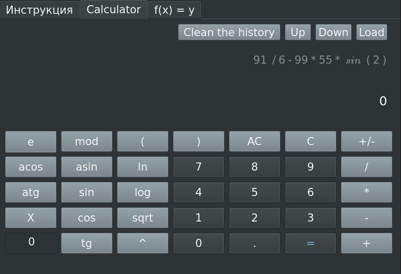
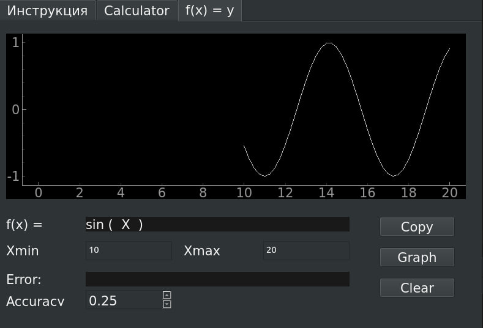

<h1 align="center">Smart Engineer Calculator</h1>

---

The Smart calculator for solve difficult algebraic expressions.

This project works Linux only. It was developed on Linux Mint using MVP model.

For starting this project you need to install PyQt5, Pyqtplot and pyinstaller first of all! Take care about it.

# Installation

`pyinstaller main.spec`

## Usage

This project consists of 3 parts:

- Instruction
- Algebraic tab
- Graph tab

### Instruction

The instruction includes the general calculator's options.

### Algebraic tab

The algebraic tab supports:

1. The simple algebraic expressions with the all main operators like: `2+2` or `2 * 88 - 44 mod 4 / 2^143 * (77)`
2. The expressions with unknown number (X): `X + 87 - X + 3`. Use the gap for X to input the number.
3. The operations with exponential numbers like: `1.023e+10 - 1.076e-1`
4. The hard operations like `sin(log(ln(tn(acos(asin(1))))))`

Also, SmartCalc has a great function, it keeps a history. Use the buttons at upper right angle.

### Graph tab

The graph tab builds the graphs for an algebraic expression from the calculator's tab.

You can set up:
1. Xmin and Xmax. Restrict your value's area.
2. Accuracy. Use this set up to change a frequency of your painting.
3. Zoom. You can change a size of your graphic to see it much better.

## Errors

Please, check the calculater instructions before use it or if you have troubles.
The main restriction:

1. You can't input the string of values in the calculater more than 255 symbols long.
2. You can't input more than 45 symbols in one argument.
3. Take care about unbehavior calculations like LOG(-1). It will throw an exception.
4. Of course you mustn't divide the zero.

## Author

Arnisfet (MRudge from 42 Ecole). Good Luck to use it puppy!

